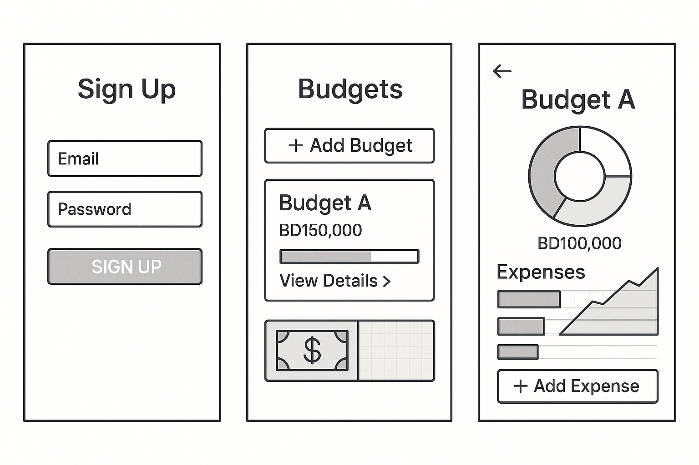

 

# BudgetItWiser

Full-stack budgeting application built with the PDR stack( PostgreSQL, Django REST Framework (Python), and React.js). This web app helps users mindfully manage personal finances, inspired by the Japanese tradition of household accounting (家計簿, kakeibo).

Users can securely sign up and log in via JWT to track budgets and expenditures. Real-time analytics using React visualize financial behaviors, while a Django backend with PostgreSQL ensures scalable APIs and reliable CRUD operations across devices.

An AI-driven budgeting assistant offers personalized financial insights, assessments of spending behaviors, enhancing budgeting ease.

## Table of Contents:

- [Deployed link](#deployed-link)
- [Planning Materials](#planning-materials)
  - [Entity Relationship Diagram (ERD)](#entity-relationship-diagram-erd)
  - [WireFrame](#wireframe)
  - [UserStory](#userstory)
  - [Component Hierarchy Diagram (CHD)](#component-hierarchy-diagrams-chd)
- [Website ShowCase](#website-showcase)
  - [ScreenShots](#screenshots)
  - [Recording](#recording)
- [How to run locally](#how-to-run-locally)
- [Technologies Used](#technologies-used)
  - [PDR Stack](#pdr-stack)
  - [Client Packages](#client-packages)
  - [Server Packages](#client-packages)
- [Future Enhancements](#future-enhancements)

## Deployed link:

https://budgetitwiser-production.up.railway.app/

 

## Planning Materials:

### Entity Relationship Diagram (ERD):

### WireFrame:

### UserStory:

- As a new user, I would like to register safely with my email and password to begin overseeing my budgets.

- As a returning user, I aim to log in and retrieve my customized financial information with a secure JWT token.

- As a user, I want to set up monthly or personalized budgets to monitor my income and expenses.

- As a user, I want to create categories (e.g. Food, Transport, Entertainment) for each budget to organize my expenses in a meaningful way.

- As a user, I want to modify or remove an budget.

- As a user, I wish to categorize expenses within my budget to track my spending effectively.

- As a user, I want to modify or remove an expense if I made an error or if the price has been adjusted.

- As a user, I would like to see charts (such as bar graphs or semi-circular gauges) illustrating my expenses compared to my budget, so I can assess whether I'm exceeding my spending limit.

- As a user, I wish to view animated trends that showcase my habits and assist in self-reflection,

- As a user, I desire my budgets, expenses, and analytics to be limited to my account to ensure that my financial information remains private and protected.

- As a user, I wish to modify my profile details if my name or email is altered.

### Component Hierarchy Diagrams (CHD):

## Website ShowCase:

### ScreenShots:

 
 

 
 

 
 

### Recording:

 
 

## How to run locally:

- Clone the repository.
- create python pipenv: `pipenv shell`
- Install server dependencies: `pipenv install`
- Go to client `cd client/` and install dependencies `npm i`
- While you at the client folder Start the client: `npm run dev`
- Go back where main_app is there and start the server `python manage.py runserver`

Open the application in your browser at `http://localhost:5173`

## Technologies Used:

### PDR Stack:

- PostgreSQL
- Django REST Framework (Python)
- React.js

### Client packages:

| Package                    | Version |
| -------------------------- | ------- |
| axios                      | ^1.11.0 |
| chart.js                   | ^4.5.0  |
| react                      | ^19.1.0 |
| react-chartjs-2            | ^5.3.0  |
| react-dom                  | ^19.1.0 |
| react-circular-progressbar | ^2.2.0  |
| react-router-dom           | ^7.7.1  |
| vite                       | ^7.0.4  |

### Server packages:

| Package                       | Version |
| ----------------------------- | ------- |
| django                        | 5.2.4   |
| psycopg2-binary               | 2.9.10  |
| djangorestframework           | 3.16.0  |
| djangorestframework-simplejwt | 5.5.1   |
| python_version                | 3.12    |
| gunicorn                      | 23.0.0  |

For more info, see the [`requirements.txt`](https://github.com/HusainNit/BudgetItWiser/blob/main/requirements.txt).

## Future Enhancements:

1. Add budget and expense context data to the ai.
2. Show errors to the client (Error Logging & Feedback Panel).
3. Enhance the Analytics page layout.
4. The ability to choose a different currency.
5. Goal-Based Budget Planning
6. Add function to sort budgets/expense.
7. Smart Alerts.
